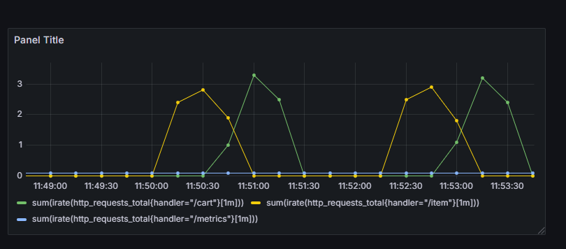

# ДЗ
### ДЗ 3

```bash
docker compose -f lecture_2/hw/docker-compose.yml up -d
```

Чтоб посмотреть графики  

```bash
python lecture_2/hw/ddos.py
```

Скрин дашборда



## Задание - REST API (3 балла)

Реализовать REST + RPC API для выдуманного интернет магазина.

Ресурсы:

- корзина (cart)

    Пример структуры ресурса:

    ```json
    {
        "id": 123,  // идентификатор корзины
        "items": [  // список товаров в корзине
            {
                "id": 1, // id товара
                "name": "Туалетная бумага \"Поцелуй\", рулон", // название
                "quantity": 3, // количество товара в корзине
                "available": true // доступе ли (не удален ли) товар
            }, 
            {
                "id": 535, 
                "name": "Золотая цепочка \"Abendsonne\"", 
                "quantity": 1,
                "available": false,
            },
        ],
        "price": 234.4 // общая сумма заказа
    }
    ```

- товар (item)

    Пример структуры ресурса:

    ```json
    {
        "id": 321, // идентификатор товара
        "name": "Молоко \"Буреночка\" 1л.", // наименование товара
        "price": 159.99, // цена товара
        "deleted": false // удален ли товар, по умолчанию false
    }
    ```

Запросы для реализации:

- cart
  - `POST cart` - создание, работает как RPC, не принимает тело, возвращает
    идентификатор
  - `GET /cart/{id}` - получение корзины по `id`
  - `GET /cart` - получение списка корзин с query-параметрами
    - `offset` - неотрицательное целое число, смещение по списку (опционально,
      по-умолчанию 0)
    - `limit` - положительное целое число, ограничение на количество
      (опционально, по-умолчанию 10)
    - `min_price` - число с плавающей запятой, минимальная цена включительно
      (опционально, если нет, не учитывает в фильтре)
    - `max_price` - число с плавающей запятой, максимальная цена включительно
      (опционально, если нет, не учитывает в фильтре)
    - `min_quantity` - неотрицательное целое число, минимальное общее число
      товаров включительно (опционально, если нет, не учитывается в фильтре)
    - `max_quantity` - неотрицательное целое число, максимальное общее число
      товаров включительно (опционально, если нет, не учитывается в фильтре)
  - `POST /cart/{cart_id}/add/{item_id}` - добавление в корзину с `cart_id`
    предмета с `item_id`, если товар уже есть, то увеличивается его количество
- item
  - `POST /item` - добавление нового товара
  - `GET /item/{id}` - получение товара по `id`
  - `GET /item` - получение списка товаров с query-параметрами
    - `offset` - неотрицательное целое число, смещение по списку (опционально,
      по-умолчанию 0)
    - `limit` - положительное целое число, ограничение на количество
      (опционально, по-умолчанию 10)
    - `min_price` - число с плавающей запятой, минимальная цена (опционально,
      если нет, не учитывает в фильтре)
    - `max_price` - число с плавающей запятой, максимальная цена (опционально,
      если нет, не учитывает в фильтре)
    - `show_deleted` - булевая переменная, показывать ли удаленные товары (по
      умолчанию `False`)
  - `PUT /item/{id}` - замена товара по `id` (создание запрещено, только замена
    существующего)
  - `PATCH /item/{id}` - частичное обновление товара по `id` (разрешено менять
    все поля, кроме `deleted`)
  - `DELETE /item/{id}` - удаление товара по `id` (товар помечается как
    удаленный)

Способ хранение данных на усмотрение.

Более подробные детали и требования к работе методов смотрите в тестах.
Модификация тестов при потребности допускается (но не смысловая).

Чтобы запустить тесты только для этого задания вызовите:

```sh
poetry run pytest -vv --showlocals --strict ./tests/test_homework_2_1.py
```

## Доп. Задание - WebSocket (+1 доп балл)

Реализовать чат для пользователей в отдельных комнатах (в примере из лекции чат
был один на всех).

Пользователи подключаются к чату по WebSocket ручке `/chat/{chat_name}`.
Пользователи, которые ввели один и тот же `chat_name` буду подключены к одному
чату (то есть будут получать сообщения друг от друга). Пользователи не
подключенные к диалогу не будут получать сообщения.

Сообщение - текст в теле сообщения от клиента. Сервер должен broadcast'ить
сообщения на других пользователей в своем чате. Каждому клиенту сервер
присваивает случайное имя и дополняет каждое сообщение именем пользователя в
начале в следующем виде: `{username} :: {message}`.
